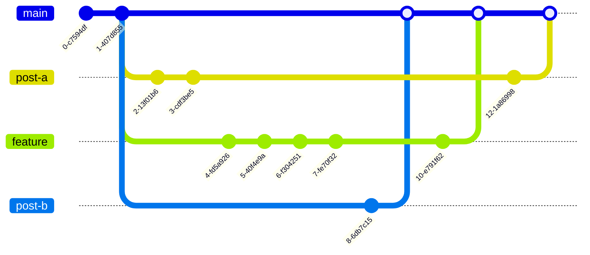

# Lopes Logbook
**Lopes Logbook** is my professional website, currently published at [lopes.id](https://lopes.id). It is a long-term knowledge base and portfolio where I document my work, research, and ideas around information security, detection engineering, automation, and adjacent domains.

The goals of this project are:

- Share knowledge in a structured and durable form  
- Showcase my professional work and evolution  
- Maintain full ownership of my content and platform  
- Provide a stable personal space on the web

---

## 📚 Stack
- **Content & site generation:** Quarto  
- **Version control:** Git + GitHub  
- **Design & assets:** Figma  
- **Automation:** Bash (hooks & helper scripts)  
- **CI/CD:** GitHub Actions  
- **Hosting:** Cloudflare Pages  

---

## 🔄 Workflow
The workflow is designed to protect the `main` branch, preserve history, and keep publishing predictable and low-stress. The philosophy is *Write like a human. Publish like an engineer.*

### Branching Model (Tailored for a Publishing System)
Branch names follow the pattern: `<namespace>/<short-description>`.

| Namespace | Purpose | Examples |
|---------|--------|---------|
| `post` | New articles | `post/gap-analysis-mitre`, `post/dfir-toolkit` |
| `revise` | Significant updates to existing posts | `revise/mitre-intro-2025` |
| `typo` | Minor textual fixes | `typo/fix-cloudflare-spelling` |
| `bugfix` | Structural or layout problems | `bugfix/navbar-overflow` |
| `design` | Visual & asset work | `design/new-og-templates` |
| `infra` | CI/CD, hosting, tooling | `infra/add-image-linter` |
| `docs` | Documentation only | `docs/architecture-update` |
| `release` | Publishing milestones | `release/2025-q1` |

This keeps intent obvious and keeps history meaningful.

### Visual Overview


---

## Automation & Quality Gates
This project enforces quality and SEO standards automatically through Git hooks and CI.

### Local Automation
Validation is enforced at commit time through a pre-commit hook:

- post structure & SEO fields  
- image size & format  
- filename constraints  
- repository hygiene  

To install automation after cloning:
```bash
chmod +x scripts/setup.sh
./scripts/setup.sh
```

This installs:

- `.git/hooks/pre-commit`: active Git hook  
- enforcement logic from `scripts/pre-commit.sh`

### Continuous Integration
All pull requests to `main` are validated via GitHub Actions:

- Quarto environment check  
- Full site render  

No code reaches `main` unless both local and CI validation succeed.

### Design Principles
- Enforcement logic lives in `scripts/`  
- Hook wiring is reproducible via `scripts/setup.sh`  
- Local and CI checks are aligned  
- Automation is deterministic and idempotent  

---

## Creating a New Post
1. Create branch:  
  ```bash
  git checkout -b post/my-new-article
  ```

2. Create post file in `posts/` using `.qmd`  
3. Generate and optimize images in `images/`  
4. Validate locally (commit will enforce rules)  
5. Push branch and open Pull Request  

---

## License
This work is licensed under [CC BY 4.0](https://creativecommons.org/licenses/by/4.0/). See [LICENSE](LICENSE.md).
